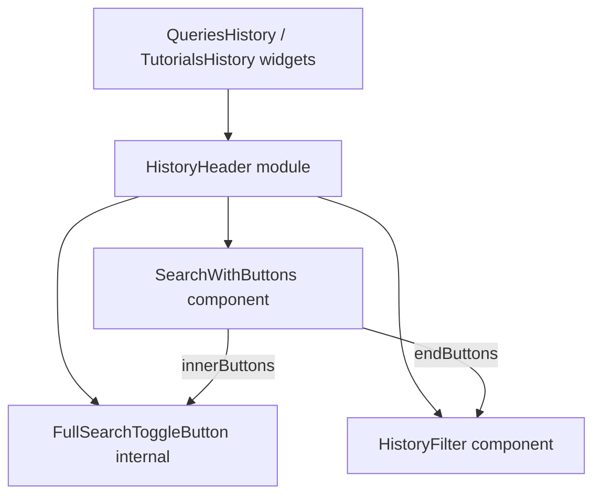

# Рефакторинг HistoryHeader: универсальный SearchWithButtons

## Контекст

Сейчас [`HistoryHeader`](src/modules/HistoryHeader/HistoryHeader.tsx:16) — модуль, собирающий:

- [`HistorySearch`](src/modules/HistoryHeader/HistorySearch.tsx:16) — `TextInput` с жёстко зашитой кнопкой переключения full-text поиска в `endContent` (иконка `ChevronsExpandHorizontalIcon`, подсветка `view="action"` при активном режиме);
- опциональный [`HistoryFilter`](src/components/HistoryFilter/HistoryFilter.tsx:14) — кнопка-воронка с попапом фильтров справа от инпута (подсветка `view={isChanged ? 'action' : 'normal'}`).

В новом дизайне похожий блок выглядит иначе: нет кнопки внутри инпута, кнопка справа — с другой иконкой. Чтобы поддерживать оба варианта без дублирования разметки/логики позиционирования, выносим универсальную "коробку" в `src/components`, а `HistoryHeader` делаем тонкой обёрткой над ней.

Используется в двух виджетах: [`QueriesHistory`](src/widgets/QueriesHistory/QueriesHistory.tsx:64) и [`TutorialsHistory`](src/widgets/TutorialsHistory/TutorialsHistory.tsx:47).

## Решение по API (обсуждено с пользователем)

- Слоты кнопок принимают **готовые `ReactNode[]`** (а не декларативные дескрипторы `{icon, onClick, view, ...}`), т.к. вся логика подсветки/состояния кнопок (full-search toggle, фильтр `isChanged`) уже инкапсулирована в самих кнопках-компонентах — поднимать её в конфиг универсального компонента избыточно и ломает инкапсуляцию.
- Новый базовый компонент кладём в `src/components/SearchWithButtons` (уровень `components`, т.к. имеет стабильный контракт пропсов и может использоваться отдельно от `HistoryHeader`).
- `HistoryHeader` остаётся в `src/modules`, использует `SearchWithButtons` внутри, публичный API `HistoryHeader` (`search`, `fullSearch`, `hasClear`, `filter`, `onUpdate`, `className`) **не меняется**.
- В рамках этой задачи новый вариант дизайна (без кнопки внутри инпута, другая иконка справа) **не реализуется** — только рефакторинг текущего `HistoryHeader` на основе `SearchWithButtons`. Новый вариант — отдельная задача позже.

## План работ

1. Создать базовый компонент `src/components/SearchWithButtons/SearchWithButtons.tsx`:
   - Пропсы: `value`, `onUpdate`, `hasClear`, `placeholder`, `className`, `innerButtons?: React.ReactNode[]`, `endButtons?: React.ReactNode[]`.
   - `innerButtons` рендерятся внутри `TextInput` через `endContent` (обёрнутые в `Flex`, если их несколько).
   - `endButtons` рендерятся в `Flex` справа от инпута (аналогично текущему месту `HistoryFilter` в `HistoryHeader`).
   - Создать `SearchWithButtons.scss` (перенести отступы из [`HistorySearch.scss`](src/modules/HistoryHeader/HistorySearch.scss:1)) и `index.ts`.

2. Экспортировать `SearchWithButtons` из [`src/components/index.ts`](src/components/index.ts:1).

3. Написать `SearchWithButtons.stories.tsx` в `src/components/SearchWithButtons` — демонстрация с несколькими кнопками в обоих слотах и без кнопок вовсе.

4. Вынести логику full-search toggle-кнопки из [`HistorySearch.tsx`](src/modules/HistoryHeader/HistorySearch.tsx:16) в отдельный маленький компонент (например `internal/FullSearchToggleButton.tsx` внутри модуля `HistoryHeader`), сохранив текущую иконку и подсветку `view="action"`.

5. Переписать [`HistoryHeader.tsx`](src/modules/HistoryHeader/HistoryHeader.tsx:16):
   - Перенести в него state `search`/`isFullSearch` (ранее жили в `HistorySearch`) и обработчики `handleOnUpdate`/`handleModeChange`.
   - Рендерить `SearchWithButtons` с `innerButtons={[<FullSearchToggleButton .../>]}` и `endButtons={filter ? [<HistoryFilter {...filter} />] : []}`.
   - Публичный API компонента (пропсы) не менять.

6. Удалить/упростить [`HistorySearch.tsx`](src/modules/HistoryHeader/HistorySearch.tsx:16) и его `.scss` — логика переехала в `HistoryHeader` + `FullSearchToggleButton`; убрать неиспользуемые файлы.

7. Обновить [`HistoryHeader.stories.tsx`](src/modules/HistoryHeader/HistoryHeader.stories.tsx:1) под новую реализацию (сценарии `Default` и `FullSearchActive` должны продолжать работать).

8. Проверить оба места использования — [`QueriesHistory.tsx`](src/widgets/QueriesHistory/QueriesHistory.tsx:64) и [`TutorialsHistory.tsx`](src/widgets/TutorialsHistory/TutorialsHistory.tsx:47) — без изменений кода в этих файлах, поведение должно остаться прежним.

9. Прогнать typecheck/build и Storybook, вручную проверить:
   - переключение full-text поиска и его подсветка;
   - открытие фильтра, подсветка при `isChanged`;
   - `hasClear` работает как раньше;
   - `className` на `HistoryHeader` по-прежнему применяется (см. использование `block('header')` в `QueriesHistory`).

## Структура файлов после рефакторинга

```text
src/
  components/
    SearchWithButtons/
      SearchWithButtons.tsx
      SearchWithButtons.scss
      SearchWithButtons.stories.tsx
      index.ts
  modules/
    HistoryHeader/
      HistoryHeader.tsx
      HistoryHeader.stories.tsx
      internal/
        FullSearchToggleButton.tsx
      index.ts
```

## Диаграмма компоновки


