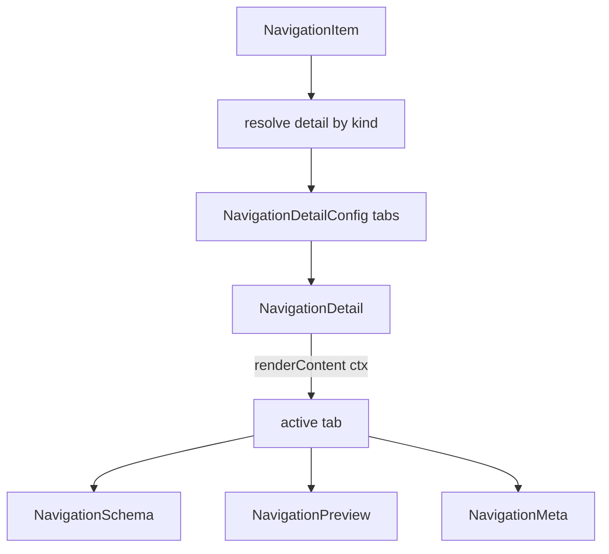

# Архитектура навигации: концепты

Обобщение серии планов по навигационному стеку (`QueriesNavigation` и модули `Navigation*`).
Документ описывает **принципы и контракты**, а не пошаговые задачи: конкретные шаги реализации
и разбор отдельных коммитов исчерпаны. Продуктовые/доменные привязки сознательно убраны —
библиотека остаётся нейтральной к системе-источнику данных.

## Состав стека

По правилам `AGENTS.md` навигация разложена на три уровня:

```text
widgets/
    QueriesNavigation           — готовый виджет: список кластеров/элементов + detail-панель
modules/
    NavigationHeader            — хлебные крошки, редактор пути, действия
    ClustersList                — список кластеров
    NavigationItemsList         — список элементов текущего пути (+ синтетическая строка «..»)
    NavigationDetail            — панель детали: заголовок, вкладки, общий поиск
    NavigationSchema            — вкладка со структурой полей (табличная)
    NavigationPreview           — вкладка с данными (табличная)
    NavigationMeta              — вкладка с метаданными (пары «ключ → значение»)
components/
    DataTable, LazyList, PathEditor, Breadcrumbs,
    SearchWithButtons, FieldsSelector, FieldsSearchToolbar,
    EmptyContent, ListSpinner
helpers/
    useVisibleColumns, useLoadMoreSentinel, getParentPath, getDefaultNavigationIcon
types/
    navigation.ts, pathEditor.ts — публичные контракты
```

Импорты идут строго в одну сторону: `widgets → modules → components`.

## Базовые принципы

1. **Нормализованные данные на входе.** Библиотека не парсит и не форматирует доменные
   структуры источника. Значения приходят уже приведёнными к строке или `ReactNode`; схема,
   строки данных и метаданные — плоские нормализованные объекты. Никаких зависимостей от
   форматов сериализации конкретной системы.
2. **Минимальный дефолт + расширяемость.** Каждый контракт содержит минимальный набор
   обязательных полей, а расширение делается через индексную подпись (`[key: string]: unknown`)
   и дженерик, протянутый до рендера. Консюмер добавляет свои поля и типобезопасно использует
   их в кастомных колонках/строках.
3. **Два уровня кастомизации.** Везде, где есть дефолтный вид, доступны оба варианта:
   *добавление* к дефолту (`view.extraColumns`, `view.extraContent`) и *полная замена*
   (`view.tableColumns`, `view.render`, `renderRowItem`). Дефолтные билдеры и дефолтные строки
   экспортируются публично, чтобы сценарий «то же, что дефолт, плюс своё» не требовал
   копирования кода.
4. **Единая форма пропсов у модулей детали:** `{data, view?, ...сквозные}`, где `data` —
   единственный источник правды по данным и состоянию (совпадает с публичным типом конфига,
   который отдаёт резолвер), `view` — изолированная группа кастомизации отображения, а наверху
   остаются только инфраструктурные пропсы (`search`, `className` и пр.). Это не даёт разрастись
   плоскому списку пропсов и убирает ручную раскладку полей конфига в местах интеграции.
5. **Controlled/uncontrolled для любого состояния.** Активная вкладка, значение поиска, набор
   видимых колонок работают в обоих режимах: если проп задан — модуль полностью следует ему,
   иначе держит внутреннее состояние. Внутренний стейт не обновляется в контролируемом режиме,
   чтобы не заводить «мертвое» состояние.
6. **Дженерики с дефолтом** вместо фиксированных типов — обратная совместимость сохраняется
   для тех, кто не расширяет модель.

## Модель данных

```text
NavigationLocation   = {cluster?, path?}
NavigationCluster    = {id, title, icon?, color?, backgroundColor?, description?}
NavigationItemKind   = 'folder' | 'file' | 'table' | 'link' | 'unknown'
NavigationItem       = {path, title, icon?, kind?, hasChildren?, targetPathBroken?, disabled?}
NavigationSortOrder  = 'asc' | 'desc'
```

Навигация «внутрь» против открытия детали определяется по `hasChildren`, а не по `kind`:
элемент с детьми — переход по пути, без детей — открытие detail-панели.

Виджет группирует сквозные настройки в конфиг-объекты (`header`, `search`, `sort`, `listState`,
`detail`) вместо плоского списка пропсов.

## Detail-панель и вкладки

Набор вкладок не зашит в виджет, а вычисляется резолвером по элементу:

```text
ResolveNavigationDetail<T> = (item: T) => NavigationDetailConfig | undefined

NavigationDetailConfig = {
    tabs: NavigationDetailTab[];
    defaultTab?: string;
    hasSearch?: boolean;
    searchPlaceholder?: string;
    actions?: NavigationHeaderAction[];
}

NavigationDetailTab = {
    id; title;
    content?: ReactNode;                                  // статический контент
    renderContent?: (ctx) => ReactNode;                   // приоритетнее content
    hidden?; disabled?;
}

NavigationDetailTabRenderContext = {search, onSearchUpdate?, searchPlaceholder?}
```

Ключевые решения:

- **Реестр по виду элемента.** Резолвер собирается из реестра `Partial<Record<NavigationItemKind,
  factory>>` плюс `fallback`. Это даёт кастомное отображение для любого вида элемента, а не только
  для табличного. Дефолт из коробки есть только для табличного вида; для остальных без
  собственной фабрики показывается заглушка.
- **Search-aware контент.** Статический `content` не может реагировать на поиск, поэтому у вкладки
  есть `renderContent(ctx)`, получающий актуальное значение поиска, колбэк его обновления и
  плейсхолдер. Правило: задан `renderContent` — используется он, иначе `content`.
- **Кто рендерит строку поиска.** Табличные вкладки рендерят собственный тулбар (поиск + выбор
  колонок), поэтому фабрика встроенных вкладок ставит `hasSearch: false`, а общий ряд поиска в
  `NavigationDetail` остаётся механизмом для кастомных наборов вкладок. Побочный эффект —
  на вкладках без тулбара (метаданные и т.п.) поиска нет, что и требовалось: поиск семантически
  относится к полям, а не к метаданным.



## Табличные вкладки: структура полей и данные

Обе вкладки построены на общем компоненте `DataTable` (скелетон-загрузка, пустые состояния) и
имеют одинаковый каркас.

Контракты:

```text
NavigationSchemaColumn = {
    name: string;                                   // имя поля
    type?: string;                                  // тип готовой строкой
    sortOrder?: 'ascending' | 'descending';         // участие в ключе + направление
    required?: boolean;
    [key: string]: unknown;                         // расширение
}
NavigationSchemaConfig<TColumn>  = {columns: TColumn[]; loading?; loaded?; errorContent?}

NavigationPreviewCell   = ReactNode                 // готовое к отображению значение
NavigationPreviewRow    = Record<string, NavigationPreviewCell>
NavigationPreviewConfig<TRow> = {columns: string[]; rows: TRow[]; loading?; loaded?; errorContent?}
```

Терминологическая тонкость: в схеме `columns` — это **строки** таблицы (поля описываемой
сущности), а `view.tableColumns` — **колонки** отображающей таблицы. В превью `columns` задают
состав и порядок колонок данных.

Поведение модулей:

- `view.tableColumns` заданы → используются как есть (полная замена вида).
- Иначе строится дефолт билдером (`buildSchemaColumns` / `buildPreviewColumns`) и к нему
  добавляются `view.extraColumns`. Билдеры экспортируются публично.
- Данные фильтруются по значению поиска: в схеме — по имени и типу поля, в превью — по подстроке
  в видимых колонках. Пустой результат поиска даёт состояние «ничего не найдено», пустые
  исходные данные — «нет данных».
- Индексная колонка отключена (`displayIndices: false`).

### Тулбар: поиск + выбор видимых колонок

Над таблицей рендерится общий тулбар (`FieldsSearchToolbar`): инпут поиска плюс кнопка выбора
видимых полей в `endButtons`. Состав опций селектора берётся из отображаемых колонок; по умолчанию
видимы все. Набор видимых колонок живёт в модуле (uncontrolled) через общий хук
`useVisibleColumns`, но переопределяется извне парой `visibleColumns` / `onVisibleColumnsChange`
плюс `defaultVisibleColumns` для стартового набора. Тулбар и сам селектор можно скрыть
(`hideToolbar`, `hideFieldsSelector`).

## Вкладка метаданных

Модель — **массив групп пар «ключ → значение»**, а не таблица: для метаданных это семантически
точнее.

```text
NavigationMetaItem  = {name: string; value: ReactNode; [key: string]: unknown}
NavigationMetaGroup = {title?: string; items: NavigationMetaItem[]}
NavigationMetaConfig = {groups: NavigationMetaGroup[]; loading?; loaded?; errorContent?}

NavigationMetaViewConfig = {
    render?: (data) => ReactNode;   // полная замена содержимого вкладки
    extraContent?: ReactNode;       // блок после дефолтных групп
}
```

Дефолт рендерит по блоку на группу: необязательный заголовок группы и список пар с прочерком
на месте пустого значения. Полная замена вида (`view.render`) имеет приоритет над всем, включая
обработку ошибок, — это осознанный «сырой» хук для консюмера. Тулбар и поиск на этой вкладке
не рендерятся.

## Переопределение строк списков

Паттерн повторяет уже принятый в списке истории: модуль принимает необязательный
`renderRowItem?: (data) => ReactNode`, и если он задан — используется вместо дефолтной строки.

```text
NavigationItemRowRenderData<T>    = {item: T; index; isActive; isParentRow}
NavigationClusterRowRenderData<T> = {cluster: T; index; isActive}
```

Особенности:

- Флаг `isParentRow` отличает синтетическую строку «..» (создаётся внутри модуля и не несёт
  дополнительных полей `T`), чтобы консюмер мог отрендерить её иначе или оставить дефолт.
- Строка «..» рендерится в двух местах — в основном списке и над пустым состоянием, — поэтому
  кастомный рендер прокидывается и в пустое состояние.
- Дженерики `TItem` / `TCluster` протянуты через виджет и модули (`items`, `onItemClick`,
  `renderRowItem`), поэтому дополнительные поля видны в типах внутри рендера. Виджет из-за этого
  объявляется обычной дженерик-функцией, а не через `React.FC`.
- Дефолтные строки остаются в `internal/`, но реэкспортируются через `index.ts` модулей и
  попадают в публичное API — для сценария «дефолт плюс своё».
- На уровне виджета пропсы называются `renderNavigationItem` / `renderClusterItem`, на уровне
  модулей — `renderRowItem` (консистентно с остальными списками библиотеки).

## Состояния

Единая схема для всех модулей детали:

- `errorContent` — ранний возврат с текстом ошибки; в конфиге состояния списка ошибка сведена к
  одному полю `error?: boolean | ReactNode` (`true` — дефолтное сообщение, `ReactNode` — свой
  контент), чтобы не было двух полей под одно состояние.
- `loading` без `loaded` — скелетон.
- `loaded` при пустых данных — пустое состояние (`EmptyContent` с вариантом `no-data`).
- Непустой поиск без совпадений — вариант `nothing-found`.

## i18n

Каждый модуль/виджет с собственным сценарием держит локализацию в `i18n/` (`en.json`, `ru.json`,
`dicts.ts`, `index.ts`) и регистрирует keyset вида `qp:navigation-schema`, `qp:navigation-preview`,
`qp:navigation-meta`. Ключи — по формату `<контекст>_<содержимое>` (`title_column-name`,
`value_sort-ascending`, `value_empty`, `context_empty`, `field_detail-search-placeholder`,
`action_configure-visible-fields`). Дублирование мелких ключей вроде `value_empty` между
keyset'ами допустимо; общая логика вроде «прочерк вместо пустого значения» лучше жила бы в одном
хелпере.

## Публичный экспорт

- `index.ts` каждого уровня явно реэкспортирует публичные единицы уровня (включая дефолтные
  строки списков и дефолтные билдеры колонок).
- Публичные типы контрактов лежат в `src/types/navigation.ts` и реэкспортируются из корневого
  `index.ts`, чтобы консюмер мог типизировать свои данные.

## Известные пробелы и договорённости

Зафиксировано по итогам ревью навигационного стека; часть закрыта, часть осознанно оставлена.

| Тема | Состояние |
|------|-----------|
| Источник действий detail-панели | Сведён к одному управляемому полю в конфиге панели; действия из резолвера домёрживаются внутри `NavigationDetail` |
| Ошибка в состоянии списка | Сведена к одному полю `error?: boolean \| ReactNode` |
| Внутренний стейт при controlled-режиме | Явно различаются controlled/uncontrolled для вкладки и поиска |
| Пустая вкладка «просмотр» | Остаётся заглушкой в публичном API: либо скрывать, либо дать резолвер/рендер |
| Точечное переопределение одной встроенной вкладки | Нельзя заменить одну вкладку, не пересобрав весь массив; есть только полная замена вида внутри модуля |
| Контекст рендера вкладки | Содержит только поиск; элемент и локацию консюмер вынужден замыкать в фабрике |
| Дефолты по видам элементов | Дефолтная фабрика есть только для табличного вида, остальные — заглушка до своей фабрики |
| Дублирование каркаса трёх модулей детали | Повторяются рендер ошибки, сборка колонок и обёртка над таблицей; кандидаты на общий хелпер, общий тип `view` для табличных модулей и общий `isEmptyValue` |
| Клик по строке «..» в непустом списке | Обработка «вверх» опирается на признак наличия детей у синтетической строки — поведение требует проверки |
| Презентационные поля модели кластера | `color` / `backgroundColor` / `description` в данных дублируют возможности кастомного рендера строки |
