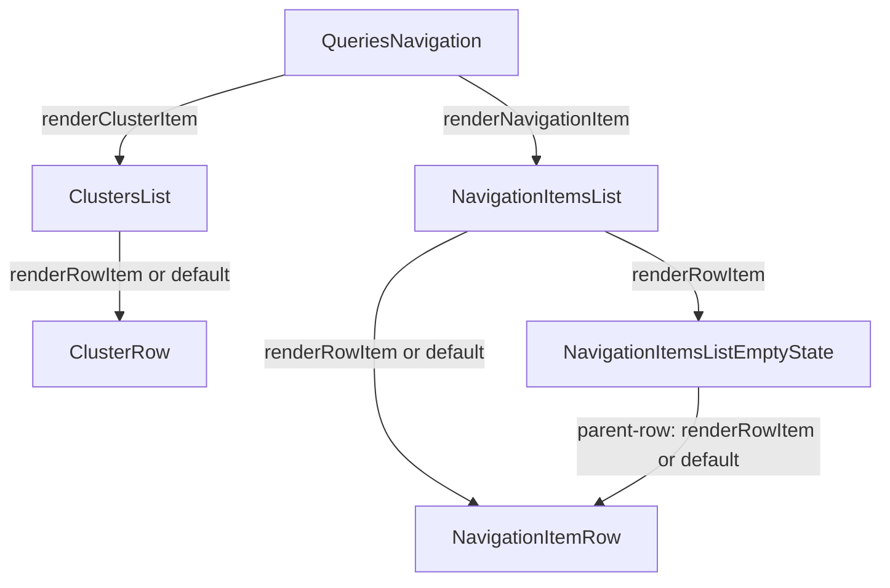

# План: переопределение строк в ClustersList и NavigationItemsList

## Цель

Дать потребителю библиотеки возможность переопределять рендер строк в двух
списках модуля навигации — [`ClustersList`](src/modules/ClustersList/ClustersList.tsx:22)
и [`NavigationItemsList`](src/modules/NavigationItemsList/NavigationItemsList.tsx:30) —
по аналогии с уже реализованным паттерном `renderRowItem` в
[`HistoryList`](src/modules/HistoryList/HistoryList.tsx:23) и его пробросом в виджет
[`QueriesHistory`](src/widgets/QueriesHistory/QueriesHistory.tsx:32).

## Эталонный паттерн (как сделано в HistoryList)

- Модуль принимает опциональный проп `renderRowItem?: (data) => React.ReactNode`.
- Если проп передан — используется он, иначе рендерится дефолтный контент строки
  ([`HistoryRowContent`](src/modules/HistoryList/HistoryRowContent.tsx:7)).
- В `data` передаётся вся информация, нужная для рендера (item, index, isActive и т.д.),
  см. `QueryHistoryRowRenderData` в [`src/types/history.ts`](src/types/history.ts:91).
- Виджет [`QueriesHistory`](src/widgets/QueriesHistory/QueriesHistory.tsx:90) просто
  пробрасывает `renderRowItem` в модуль.

## Ключевые особенности навигации

1. `ClustersList` рендерит [`ClusterRow`](src/modules/ClustersList/internal/ClusterRow.tsx:12)
   для каждого `NavigationCluster`.
2. `NavigationItemsList` рендерит [`NavigationItemRow`](src/modules/NavigationItemsList/internal/NavigationItemRow.tsx:13)
   в двух местах:
   - в основном `LazyList` (для каждого `NavigationItem`, включая синтетическую parent-row `..`);
   - внутри [`NavigationItemsListEmptyState`](src/modules/NavigationItemsList/internal/NavigationItemsListEmptyState.tsx:16)
     для parent-row над empty-content.

   Значит, кастомный рендер должен применяться в обоих местах, и его нужно
   пробросить в `NavigationItemsListEmptyState`.
3. `LazyList` уже отдаёт в `renderItem` сигнатуру `(item, isActive, index)`
   (см. [`LazyList`](src/components/LazyList/LazyList.tsx:21)) — можно использовать её
   как основу для render-данных.

## Дженерики: возможность передать расширенный объект данных

Сейчас [`NavigationItem`](src/types/navigation.ts:29) и
[`NavigationCluster`](src/types/navigation.ts:18) — фиксированные типы, а модули
жёстко типизированы `NavigationItem[]` / `NavigationCluster[]`. Если потребитель
передаст объект с доп. полями (`cluster.env`, `item.owner` и т.п.), внутри
`renderRowItem` эти поля будут не видны в типах.

Эталон `HistoryList` решает это дженериком `<T extends QueryHistoryRow>`, протянутым
через `items` / `renderRowItem` / `onItemClick` / `getRowActions`. Применяем тот же
подход к навигации: делаем оба модуля и типы render-данных дженериками с дефолтом,
что сохраняет обратную совместимость (кто не использует доп. поля — ничего не меняет).

## Дизайн API

### Типы (в [`src/types/navigation.ts`](src/types/navigation.ts:1))

```ts
export type NavigationItemRowRenderData<T extends NavigationItem = NavigationItem> = {
    item: T;
    index: number;
    isActive: boolean;
    /** true, если это синтетическая parent-row ".." (не несёт доп. полей T) */
    isParentRow: boolean;
};

export type NavigationClusterRowRenderData<T extends NavigationCluster = NavigationCluster> = {
    cluster: T;
    index: number;
    isActive: boolean;
};

export type RenderNavigationItem<T extends NavigationItem = NavigationItem> =
    (data: NavigationItemRowRenderData<T>) => React.ReactNode;
export type RenderNavigationCluster<T extends NavigationCluster = NavigationCluster> =
    (data: NavigationClusterRowRenderData<T>) => React.ReactNode;
```

Примечание: `isParentRow` полезен, т.к. parent-row `..` — синтетическая строка
(создаётся внутри в [`useParentRow`](src/modules/NavigationItemsList/internal/useParentRow.ts:10)
как базовый `NavigationItem` без доп. полей `T`), и потребитель может отрендерить её
иначе либо оставить дефолт. Финальный состав полей уточняется на ревью.

### ClustersList

- Сделать дженериком: `ClustersList<T extends NavigationCluster = NavigationCluster>`.
- `items: T[]`, `onItemClick?: (cluster: T) => void`.
- Добавить проп `renderRowItem?: RenderNavigationCluster<T>`.
- В `renderItem` использовать `renderRowItem?.(data) ?? <ClusterRow cluster={cluster} />`.

### NavigationItemsList

- Сделать дженериком: `NavigationItemsList<T extends NavigationItem = NavigationItem>`.
- `items: T[]`, `onItemClick?: (item: T) => void`.
- Добавить проп `renderRowItem?: RenderNavigationItem<T>`.
- Использовать его в основном `LazyList.renderItem`.
- Пробросить `renderRowItem` в `NavigationItemsListEmptyState`, чтобы parent-row в
  empty-state рендерился тем же кастомным рендером (с `isParentRow: true`).

### NavigationItemsListEmptyState

- Принять `renderRowItem?: RenderNavigationItem` и применить к parent-row
  вместо жёсткого `NavigationItemRow`.

### Виджет QueriesNavigation

- Сделать дженериком по типам item/cluster:
  `QueriesNavigation<TItem extends NavigationItem = NavigationItem, TCluster extends NavigationCluster = NavigationCluster>`.
- Протянуть `TItem` / `TCluster` через `items` / `clusters` / `onItemClick` /
  `onClusterClick`.
- Добавить пропы `renderNavigationItem?: RenderNavigationItem<TItem>` и
  `renderClusterItem?: RenderNavigationCluster<TCluster>`.
- Пробросить их в `NavigationItemsList` (как `renderRowItem`) и `ClustersList`
  (как `renderRowItem`) соответственно.
- Примечание: `QueriesNavigation` сейчас объявлен как `FC<QueriesNavigationProps>` —
  для дженерика придётся переписать сигнатуру на обычную дженерик-функцию
  (как сделано в [`QueriesHistory`](src/widgets/QueriesHistory/QueriesHistory.tsx:39)),
  т.к. `React.FC` не поддерживает дженерики.

## Экспорт дефолтных строк

Чтобы потребитель мог переиспользовать/обернуть дефолтную строку внутри своего
рендера (частый сценарий: «то же, что дефолт, но с доп. элементом»), сделать
`NavigationItemRow` и `ClusterRow` частью публичного API.

Решение: **оставляем компоненты в `internal/`** и ре-экспортируем их через `index.ts`
модулей:

- [`src/modules/ClustersList/index.ts`](src/modules/ClustersList/index.ts:1) —
  добавить `export {ClusterRow}` и `export type {ClusterRowProps}`.
- [`src/modules/NavigationItemsList/index.ts`](src/modules/NavigationItemsList/index.ts:1) —
  добавить `export {NavigationItemRow}` и `export type {NavigationItemRowProps}`.
- Далее эти реэкспорты подхватываются в [`src/modules/index.ts`](src/modules/index.ts:1)
  и [`src/index.ts`](src/index.ts:1).

## Диаграмма потока рендера



## Шаги реализации

1. Добавить типы render-данных и render-функций в [`src/types/navigation.ts`](src/types/navigation.ts:1).
2. Вынести/экспортировать дефолтные строки `NavigationItemRow` и `ClusterRow` в
   публичный API согласно [`AGENTS.md`](AGENTS.md:1).
3. Добавить `renderRowItem` в [`ClustersList`](src/modules/ClustersList/ClustersList.tsx:22).
4. Добавить `renderRowItem` в [`NavigationItemsList`](src/modules/NavigationItemsList/NavigationItemsList.tsx:30)
   (основной список).
5. Пробросить `renderRowItem` в [`NavigationItemsListEmptyState`](src/modules/NavigationItemsList/internal/NavigationItemsListEmptyState.tsx:16)
   для parent-row.
6. Добавить `renderNavigationItem`/`renderClusterItem` в
   [`QueriesNavigation`](src/widgets/QueriesNavigation/QueriesNavigation.tsx:42) и пробросить в модули.
7. Обновить barrel-экспорты: index.ts модулей,
   [`src/modules/index.ts`](src/modules/index.ts:1), [`src/index.ts`](src/index.ts:1)
   (новые типы + дефолтные компоненты строк).
8. Добавить/обновить stories с примером переопределения строк для `ClustersList`,
   `NavigationItemsList` и `QueriesNavigation`.
9. Проверить сборку и Storybook.

## Решения

- Render-данные включают флаг `isParentRow` — потребитель отличает синтетическую
  parent-row `..` и не ожидает от неё доп. полей `T`. (Подтверждено.)
- Модули и типы render-данных делаем дженериками с дефолтом
  (`NavigationItem` / `NavigationCluster`) — обратная совместимость сохраняется.

## Открытые вопросы для ревью

- Именование пропа в модулях: `renderRowItem` (как в `HistoryList`) — оставить так
  для консистентности.
- Именование пропов виджета: `renderNavigationItem` / `renderClusterItem`.
- Нужно ли выносить `NavigationItemRow` / `ClusterRow` в `src/components/` или
  достаточно ре-экспорта из `internal/`.
- Делать ли дженериком сам виджет `QueriesNavigation` или оставить дефолтные типы.
