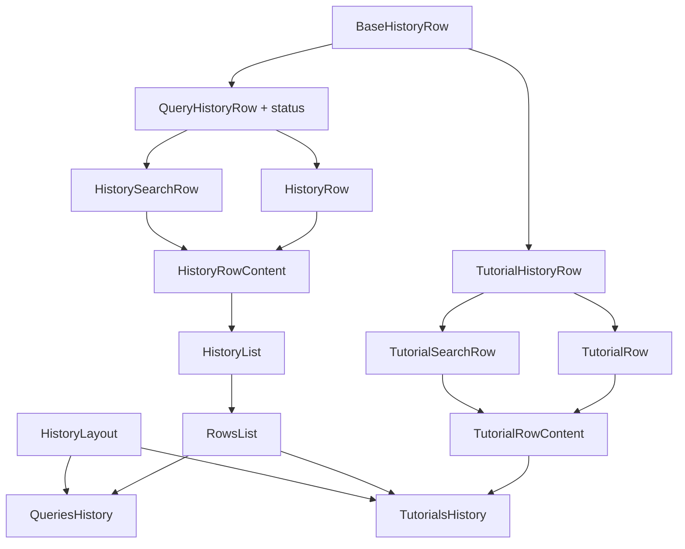

# План: виджет TutorialsHistory на базе инфраструктуры QueriesHistory

## Контекст и развилка

`TutorialsHistory` — частный случай [`QueriesHistory`](src/widgets/QueriesHistory/QueriesHistory.tsx:39): список туториалов без выбора видимых полей (`FieldsSelector` скрыт), с использованием [`TutorialRow`](src/modules/TutorialRow/TutorialRow.tsx:9) вместо [`HistoryRow`](src/modules/HistoryRow/HistoryRow.tsx:18).

Проблема: [`QueryHistoryRow`](src/types/history.ts:13) требует обязательное поле `status`, которого нет у туториалов. `status` используется внутри [`QueryStatusIcon`](src/components/QueryStatusIcon/QueryStatusIcon.tsx:28), [`QueryDuration`](src/components/QueryDuration/QueryDuration.tsx:17)/[`useQueryDuration`](src/components/QueryDuration/useQueryDuration.ts), [`HistoryRow`](src/modules/HistoryRow/HistoryRow.tsx:18), [`HistorySearchRow`](src/modules/HistorySearchRow/HistorySearchRow.tsx:21).

**Решение:** выделить базовый тип `BaseHistoryRow` (id/title/query?/href? + `HistoryRowRenderProps`), от которого наследуется `QueryHistoryRow` (добавляя обязательный `status` и query-специфичные поля). Общая generic-инфраструктура (`QueryHistoryItem`, `QueryHistoryRowRenderData` и связанные конфиги) параметризуется `BaseHistoryRow`, а status-специфичные компоненты (`HistoryRow`, `HistorySearchRow`, `QueryStatusIcon`, `QueryDuration`) продолжают требовать `QueryHistoryRow`. Обратная совместимость сохраняется — `QueryHistoryRow` всё ещё удовлетворяет `BaseHistoryRow`.

## Согласованный набор возможностей TutorialsHistory

Остаётся: `title`, `logo`, `search`, `filter`, `items`, `selectedRowId`, `onListItemClick`/`href`.
Убирается: `visibleFields`/`FieldsSelector`, `comparison`, `editing`, `getRowActions`.

Полнотекстовый поиск (`fullSearch`) остаётся — для него будет отдельный `TutorialSearchRow` (аналог [`HistorySearchRow`](src/modules/HistorySearchRow/HistorySearchRow.tsx:21)) с Monaco-редактором, но в шапке только `id` и `title`, без `status`/`engine`/`mode`/`isPrivate`.

## Диаграмма компонентов

Список один — [`RowsList`](../src/modules/RowsList/RowsList.tsx): он владеет виртуализацией, высотами строк и пустым состоянием, а разметку строки получает через `renderRow`. [`HistoryList`](../src/modules/HistoryList/HistoryList.tsx) — тонкая обёртка над ним с query-строками по умолчанию. Каркас виджета (logo/actions, title, header, footer) вынесен в [`HistoryLayout`](../src/modules/HistoryLayout/HistoryLayout.tsx).

## Чек-лист реализации

1. **Типы** — вынести `BaseHistoryRow` в [`src/types/history.ts`](src/types/history.ts:13), ослабить generic-constraint (`QueryHistoryRow` → `BaseHistoryRow`) у `QueryHistoryItem`, `QueryHistoryRowAction`, `QueryHistoryEditingConfig`, `QueryHistoryComparisonConfig`, `QueryHistoryVisibleFieldsConfig`, `RowFieldKey`/`QueryHistoryFieldKey`, `QueryHistoryEditingRenderData`, `QueryHistoryRowRenderData`. `QueryHistoryRow` = `BaseHistoryRow & {status: QueryStatus, engine?, mode?, isPrivate?, startTime?, endTime?}`.
2. **Новый тип** — создать [`src/types/tutorial.ts`](src/types/tutorial.ts) с `TutorialHistoryRow` (на основе `BaseHistoryRow`, с запасом на будущие поля), реэкспортировать через [`src/index.ts`](src/index.ts:1).
3. **Промоут общих компонентов** — вынести [`HistoryGroupHeader`](src/modules/HistoryList/HistoryGroupHeader.tsx:1) и [`HistoryListEmpty`](src/modules/HistoryList/HistoryListEmpty/HistoryListEmpty.tsx:10) (со scss/i18n) из `src/modules/HistoryList/*` в `src/components/HistoryGroupHeader/` и `src/components/HistoryListEmpty/`; обновить импорты в [`HistoryRowContent.tsx`](src/modules/HistoryList/HistoryRowContent.tsx:1)/[`HistoryList.tsx`](src/modules/HistoryList/HistoryList.tsx:1) и barrel-экспорты.
4. **Общий хелпер** — перенести [`prepareRowData`](src/modules/HistoryList/helpers/prepareRowData.ts:21) в `src/helpers/prepareRowData.ts`, ослабить constraint до `BaseHistoryRow`, обновить импорт в `HistoryList.tsx`.
5. **Общие Monaco-хелперы** — вынести [`fitQueryToVisibleLines`](src/modules/HistorySearchRow/helpers/fitQueryToVisibleLines.ts:3), [`resolveMonacoLanguage`](src/modules/HistorySearchRow/helpers/resolveMonacoLanguage.ts:3), [`MONACO_CONFIG`](src/modules/HistorySearchRow/monacoConfig.ts:5) из `src/modules/HistorySearchRow/*` в `src/helpers/`, обновить импорт в `HistorySearchRow.tsx`.
6. **TutorialRow** — доработать [`src/modules/TutorialRow/TutorialRow.tsx`](src/modules/TutorialRow/TutorialRow.tsx:9): принимать `item: TutorialHistoryRow`, поддержать `href`/`isActive`-стилизацию по аналогии с `HistoryRow` (без статус-иконки, меню, editing, comparison); добавить `TutorialRow.scss` и `.stories.tsx`.
7. **TutorialSearchRow** — создать `src/modules/TutorialSearchRow/` по аналогии с `HistorySearchRow`: в шапке только `id`+`title`, ниже Monaco-редактор с `query` (реюз общих Monaco-хелперов); добавить scss и `.stories.tsx`.
8. **RowsList вместо отдельного TutorialList** — не копировать `HistoryList`, а вынести generic-список в `src/modules/RowsList/` (`T extends BaseHistoryRow`, обязательный `renderRow`, `rowVariant` пробрасывается в `renderRow`); `HistoryList` переписать как обёртку над ним. Строки туториалов переключает `TutorialRowContent`, живущий внутри виджета.
9. **TutorialsHistory widget** — создать `src/widgets/TutorialsHistory/`: `HistoryLayout` + `RowsList` с `renderRow={TutorialRowContent}`; без `FieldsSelector`/`visibleFields`/`comparison`/`editing`/`getRowActions`; оставить `title`/`logo`/`search`/`filter`/`items`/`selectedRowId`/`onListItemClick`; generic по `T extends TutorialHistoryRow`; i18n-кейсет `qp:tutorials` с ключом `title_tutorials`; добавить `.stories.tsx`.
10. **Barrel-экспорты** — обновить `src/modules/index.ts`, `src/widgets/index.ts`, `src/components/index.ts`, `src/index.ts`.
11. **Проверка** — прогнать сборку и Storybook, исправить возможные TS-ошибки после ослабления generic-constraints.
